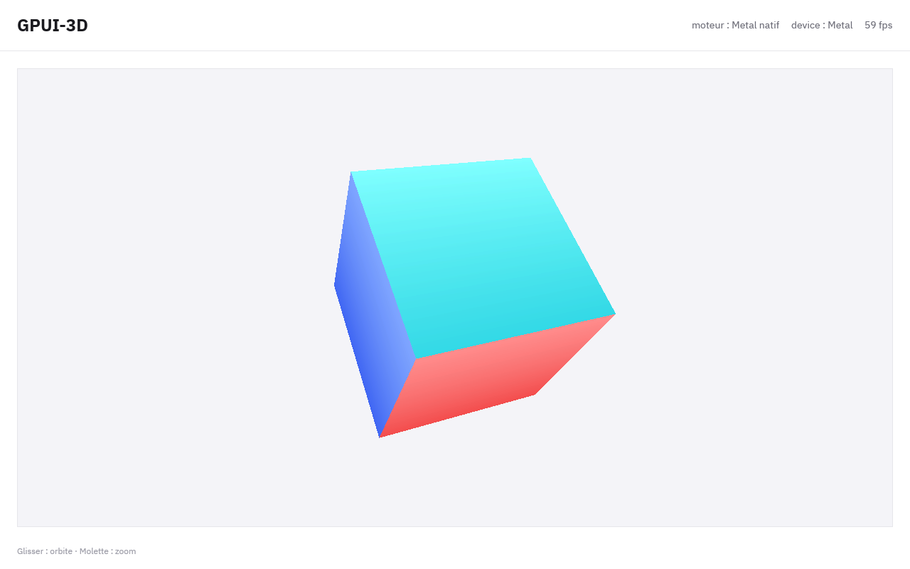
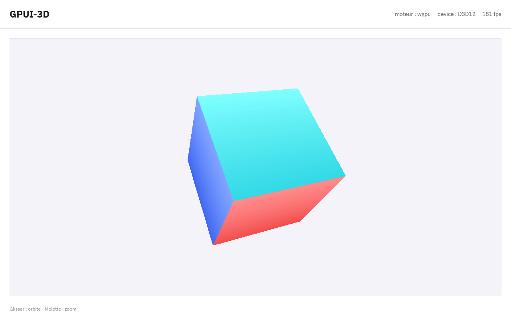
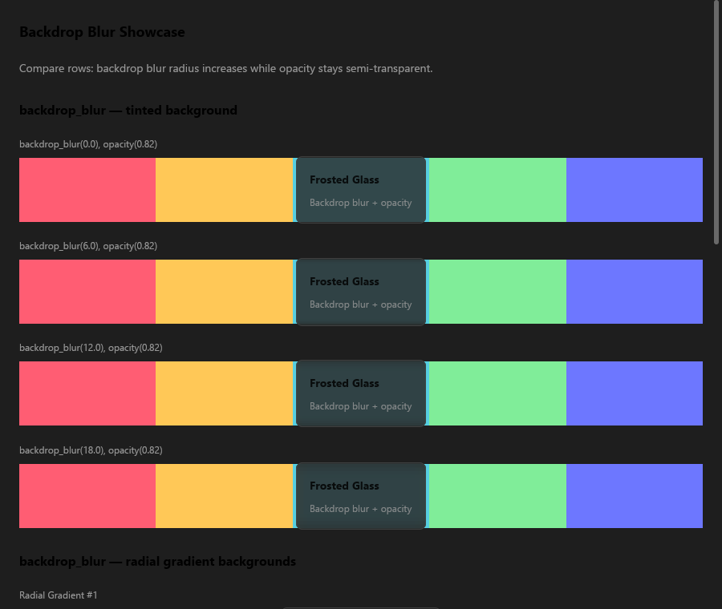

# GPUI-3D

**A starter kit for desktop apps that pair a [GPUI](https://www.gpui.rs/) user interface with
a real-time 3D engine — on one GPU device, with zero copies, and with the UI chrome never
redrawn for a 3D frame.**

Pick how the UI is rendered:

- **wgpu** — the UI renders through wgpu, which abstracts the graphics API; your 3D engine
  renders with wgpu or with the native API behind it.
- **Full native** — the UI renderer *and* your 3D engine both talk to the native API
  directly: Vulkan, Direct3D 12, OpenGL or Metal. wgpu is not in the binary at all.

*Version française : [README.fr.md](README.fr.md).*

| Vulkan (full native) | Direct3D 12 (full native) | OpenGL (full native) |
|---|---|---|
|  |  |  |
| **Metal (full native)** | **wgpu** | **UI: backdrop blur, native OpenGL** |
|  |  |  |

The demo is a spinning cube behind a white GPUI chrome: drag to orbit, scroll to zoom, with an
FPS counter.

## Variants

Each folder is a complete, copyable app. They share the UI shell in [`shell/`](shell/src/lib.rs).

| Folder | 3D engine | UI renderer | Platforms | Verified on |
|---|---|---|---|---|
| [`GPUI-WGPU`](GPUI-WGPU/src/main.rs) | wgpu (WGSL) | wgpu | wgpu's backends: Vulkan, Metal, D3D12, GL | Windows 11 (D3D12, Vulkan), macOS 26 (Metal) |
| [`GPUI-VULKAN`](GPUI-VULKAN/src/main.rs) | Vulkan (ash, GLSL → SPIR-V) | **Vulkan** | Vulkan 1.3 | Windows 11 |
| [`GPUI-DX12`](GPUI-DX12/src/dx12_cube.rs) | Direct3D 12 (windows-rs, HLSL) | **Direct3D 12** | Windows 10+ | Windows 11 |
| [`GPUI-OPENGL`](GPUI-OPENGL/src/opengl_cube.rs) | OpenGL 4.5 core (WGL, GLSL) | **OpenGL 4.5** | Windows (WGL) | Windows 11 |
| [`GPUI-METAL`](GPUI-METAL/src/metal_cube.rs) | Metal (objc2-metal, MSL) | **Metal** | macOS | macOS 26.5, Apple M1 Max |

Native engines never depend on wgpu: GPUI hands them raw handles (`VkDevice`/`VkImage`,
`ID3D12Device`/`ID3D12Resource`, a shared `HGLRC` and texture name, `MTLDevice`/`MTLTexture`)
and they do everything else with the API itself.

## Quickstart

Requirements: a stable Rust toolchain (edition 2024) and a GPU driver for the API you pick.
macOS needs the Xcode command line tools.

```bash
git clone <this repository> && cd GPUI-3D
cargo run -p gpui-vulkan     # Windows (Linux: untested)
cargo run -p gpui-dx12       # Windows
cargo run -p gpui-opengl     # Windows
cargo run -p gpui-metal      # macOS
cargo run -p gpui-wgpu       # anywhere wgpu runs
```

Build one variant at a time (`-p`): building the whole workspace unifies Cargo features and
also compiles wgpu into the full-native variants, where it then sits unused.

To start your own app, copy the folder of the variant you want, replace `CUBE_*` and the
shader, and keep the `Renderer` implementation shape: `new(surface)` creates GPU resources,
`render(surface, scene)` records one frame and publishes it. The UI lives in
`shell/src/lib.rs` (`Shell::render`).

## How it works

1. **One device.** GPUI creates the GPU device for the UI; the 3D engine renders on that same
   device (and queue) through native handles.
2. **A triple-buffered surface** (`window.create_surface(w, h, SurfaceFormat)`, displayed by
   `gpu_surface(handle)`): the engine renders into the back buffer while the compositor samples
   the displayed one. No readback, no copy.
3. **A dedicated render thread** paced on the display refresh rate with absolute deadlines,
   holding `submit_guard()` while it encodes and submits.
4. **Publishing without redrawing the chrome:** `swap_buffers()` then `request_window_redraw()`
   — the window recomposes its cached scene. Never `cx.notify()` per frame: it forces a full UI
   redraw.
5. **Gestures do not notify:** the camera lives in an `Arc<Mutex<_>>` written by mouse handlers
   and read by the render thread.

Under the hood, the UI renderer is a single generic renderer over a small internal GPU layer
(`vendor/wgpui/src/platform/cross/hal.rs`) with five implementations — wgpu, Vulkan, Direct3D 12,
OpenGL, Metal. The UI's WGSL shaders are translated at build time by
[naga](https://github.com/gfx-rs/wgpu/tree/trunk/naga) (SPIR-V, HLSL → DXBC, GLSL 4.50, MSL).
See [docs/ARCHITECTURE.md](docs/ARCHITECTURE.md) for the layer, the per-API synchronization
contracts and how the backends were verified.

## Environment variables

| Variable | Effect |
|---|---|
| `GPUI3D_TIME=1.3` | Freezes the scene, for pixel comparisons between variants. |
| `WGPU_BACKEND=vulkan\|dx12\|metal\|gl` | Forces a wgpu backend in `GPUI-WGPU`. |
| `GPUI_RENDERER=wgpu\|vulkan\|dx12\|opengl\|metal` | Picks the UI backend in the fork's own examples (`vendor/wgpui/examples`). |
| `GPUI_D3D12_DEBUG=1` | Enables the D3D12 debug layer (Windows "Graphics Tools") and relays its messages to stderr. |
| `GPUI_GL_DEBUG=1` | Creates a debug OpenGL context and relays driver errors to stderr. |
| `MTL_DEBUG_LAYER=1` | Enables Metal API validation (macOS). |
| `GPUI_FRAME_DUMP=frame.bmp` | Writes every presented frame to a BMP, read back by the GPU (wgpu and Metal) — a screenshot without screen access, e.g. over SSH. |

## Known limitations

- **OpenGL** is implemented with WGL, so Windows only (no GLX/EGL yet).
- **Vulkan full native** requires Vulkan 1.3 (dynamic rendering). MoltenVK on macOS is untested.
- **Linux** has not been tested with any variant.
- **Metal:** interactive window resizing has not been tested (the Mac was driven over SSH).
- **Backdrop blur:** D3D12, OpenGL and Metal windows are opaque, while Vulkan uses premultiplied
  alpha, so blurred backdrops differ slightly between these APIs — exactly as they do with wgpu.
- The fork's test suite has two pre-existing flaky behaviours (an order-dependent profiler test,
  and GPU tests that occasionally stall when many headless devices are created in parallel).

## Repository layout

```
shell/              GPUI chrome, camera and render thread, shared by all variants
GPUI-WGPU/          wgpu engine (WGSL)
GPUI-VULKAN/        native Vulkan engine (GLSL compiled to SPIR-V by build.rs)
GPUI-DX12/          native Direct3D 12 engine (HLSL compiled at startup)
GPUI-OPENGL/        native OpenGL engine (WGL, bindings generated by build.rs)
GPUI-METAL/         native Metal engine (MSL)
vendor/wgpui/       GPUI fork (WGPUI / gpui-ce) with the "GPUI-3D" patches
vendor/priority-threadpool/   patched thread pool used by GPUI's timers
tools/bench/        pixel-comparison scripts used to verify the backends
docs/               architecture notes and screenshots
```

## License

Original GPUI-3D code is dual-licensed under [MIT](LICENSE-MIT) or [Apache-2.0](LICENSE-APACHE),
at your option. Vendored third-party code keeps its own license — see [NOTICE](NOTICE):
`vendor/wgpui` is Apache-2.0 (derived from Zed's GPUI), `vendor/priority-threadpool` is MIT,
and the bundled fonts are under the SIL Open Font License.
